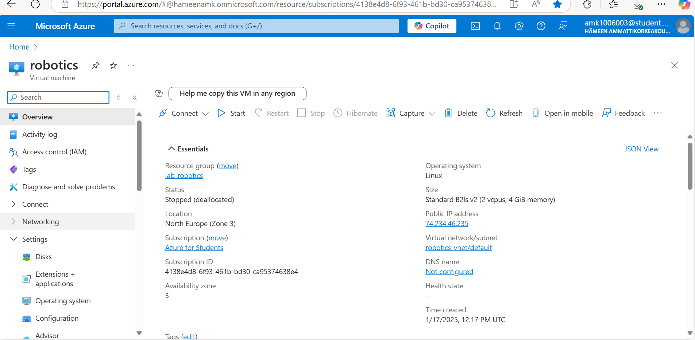
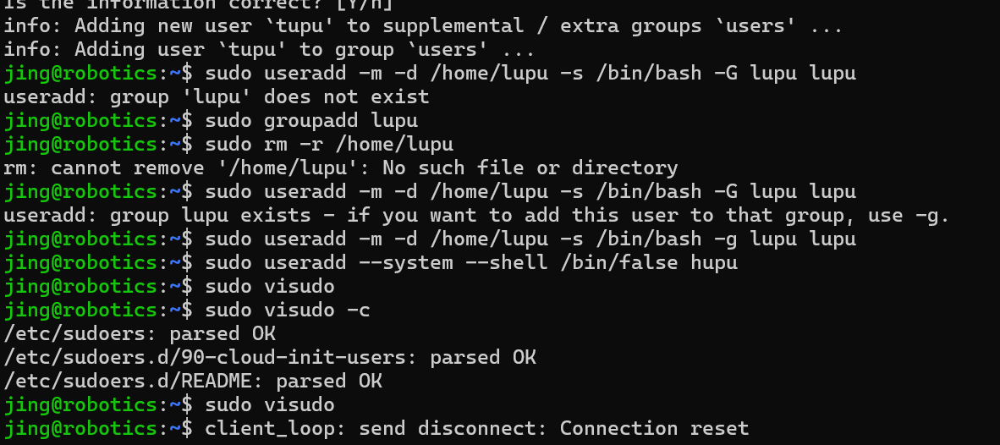
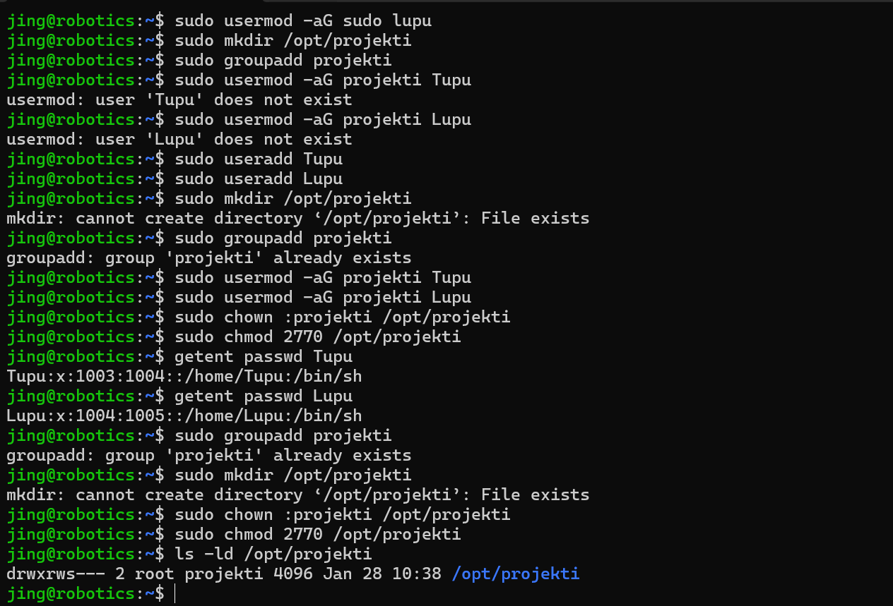

# Linux-J.W
## 2025-1-17 VM CREATION

I created a virtual machines at Azure followed by these steps:

1. select Marketplace from Ubuntu Server 24.04 LTS gen 2 Server published by Canonical.

2. name my machine logically: robotics

3. Set the machine virtual machine size to Standard_B2ls_v2. 

4. Specify the public ip :74.234.46.235

5. Create my username:jing and ssh key

6. Create a new resource group:lab-robotics for the machine and a subnet to place the machine in 

## 2025-1-18 USER MANAGEMENT AND FILE SYSTEM ACCESS
During this task I tried to create users and use created users to test out file access permissions. The details as followed:
1. use the 'sudo adduser tupu' instruction to create the Tupu user.

2. use the 'useradd' command to create the user, I used the 'man **' command to check out what is the difference between 'adduser' and 'useradd'. 
Then I know 'adduser' acts as a wrapper around 'useradd'. It creates home directory by default.Interactively prompts for password and user information.Also sets up default shell, groups, and permissions.

3. create Hupu system user with the login shell set to /bin/false
4. add the users Tupu and Lupu to the sudo users.

5. the output is :
drwxrws--- 2 root projekti 4096 Jan 28 10:38 /opt/projekti
it indicates :
d: this is a directory
rwx: First triplet shows owner (root) permissions:

r = read permission
w = write permission
x = execute permission

rws: Second triplet shows group (projekti) permissions:

r = read permission
w = write permission
s = setgid bit is set (means new files created in this directory will inherit the directory's group ownership)

---: Third triplet shows others have no permissions (no read/write/execute)

That is the whole work I have done.