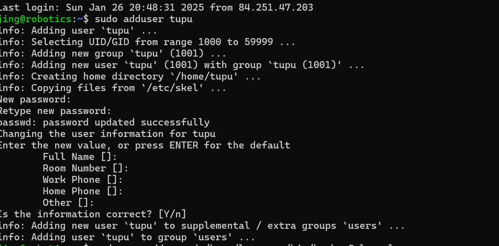

# Linux-J.W
## 2025-1-17 VM CREATION

I created a virtual machines at Azure followed by these steps:

1. select Marketplace from Ubuntu Server 24.04 LTS gen 2 Server published by Canonical.

2. name my machine logically: robotics

3. Set the machine virtual machine size to Standard_B2ls_v2. 

4. Specify the public ip :74.234.46.235

5. Create my username:jing and ssh key

6. Create a new resource group:lab-robotics for the machine and a subnet to place the machine in 

## 2025-1-18 USER MANAGEMENT AND FILE SYSTEM ACCESS
During this task I tried to create users and use created users to test out file access permissions. The details as followed:
1. use the 'sudo adduser tupu' instruction to create the Tupu user.

2. use the 'useradd' command to create the user, I used the 'man **' command to check out what is the difference between 'adduser' and 'useradd'. 
Then I know 'adduser' acts as a wrapper around 'useradd'. It creates home directory by default.Interactively prompts for password and user information.Also sets up default shell, groups, and permissions.

3. create Hupu system user with the login shell set to /bin/false
4. add the users Tupu and Lupu to the sudo users.

5. the output is :
drwxrws--- 2 root projekti 4096 Jan 28 10:38 /opt/projekti
it indicates :
d: this is a directory
rwx: First triplet shows owner (root) permissions:

r = read permission
w = write permission
x = execute permission

rws: Second triplet shows group (projekti) permissions:

r = read permission
w = write permission
s = setgid bit is set (means new files created in this directory will inherit the directory's group ownership)

---: Third triplet shows others have no permissions (no read/write/execute)

That is the whole work I have done.

## 2025-2-12 APT

***PART 1***
1. *apt --version*

APT version: apt 2.7.14 (amd64)

2. *sudo apt update*

Running sudo apt update is essential as it refreshes the system’s package list, ensuring access to the latest software versions. It syncs package metadata from repositories, preventing outdated installations. This step helps resolve dependency issues, avoids installation failures, and prepares the system for upgrades (sudo apt upgrade). Without updating, the system might install older versions or miss security patches. In short, it ensures software management is accurate, secure, and up-to-date.

3. *sudo apt upgrade -y* 

apt update prepares the system by checking for updates, while apt upgrade applies those updates to installed packages.

4. *apt list --upgradable*

The result is: Listing...Done. So there is no any pending updates.

***PART 2***

5. *apt search image editor*

package name: chntpw

6. *apt show chntpw*

 Depends: libc6 (>= 2.34)

7. *sudo apt install chntpw -y*

8.  *apt list --installed | grep chntpw*

VERSION:chntpw/noble,now 140201-1 amd64 [installed]

***PART 3***

9. *sudo apt remove chntpw -y*

No, apt remove <package-name> only removes the package but keeps its configuration files.

10. *sudo apt purge chntpw -y*

apt remove deletes the package but keeps configuration files, while apt purge removes both the package and its configuration files.

11. *sudo apt autoremove -y*

apt autoremove removes unnecessary dependencies that were installed with other packages but are no longer needed, freeing up disk space.

12. *sudo apt clean*

apt clean deletes all downloaded package files from the APT cache (/var/cache/apt/archives/), reducing storage usage.

***PART 4***

13. *cat /etc/apt/sources.list*

It indicates that Ubuntu sources have moved to /etc/apt/sources.list.d/ubuntu.sources. This means the system is using the new deb822 format for managing repositories.

14. *sudo add-apt-repository universe*

*sudo apt update*

The universe repository contains community-maintained packages that are not officially supported by Ubuntu. These packages are contributed and maintained by the open-source community rather than by Ubuntu’s core team.

15. *sudo apt install fakepackage*

sudo apt install fakepackage
- The error message is:
*E: Unable to locate package fakepackage*
This means that the package fakepackage does not exist in any of the configured APT repositories.

- How would you troubleshoot this issue?
	1.	Check for typos – Ensure the package name is correct.
	2.	Update package lists – Run sudo apt update to refresh the repository index.
	3.	Enable required repositories – Some packages are in universe or multiverse, which may need to be added using sudo add-apt-repository universe and then updating.
	4.	Search for the package – Use apt search <package-name> to see if it exists in the repositories.
	5.	Check alternative sources – If the package isn’t available, consider downloading it manually from an external source or using snap or flatpak if supported.

 