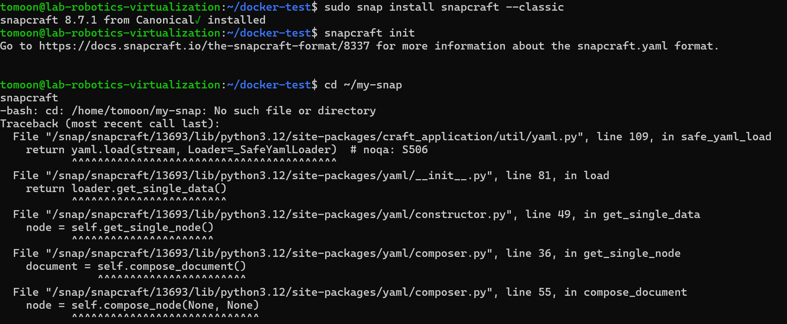

# Virtualization
## Part 1:Introduction to virtualization concepts
**Core Differences Between VMs and Containers**

**Architecture**
- *Virtual Machines (VMs)*: Run on hypervisors and include a complete operating system plus virtual hardware. Each VM contains its own kernel, libraries, and application.
- *Containers*: Share the host OS kernel and run as isolated processes. Containers package only the application code, runtime, system tools, and libraries needed to run the software.

**Resource Utilization**
- *VMs*: Higher resource consumption since each VM runs a complete OS instance with its own memory allocation, virtual CPU, and disk space.
- *Containers*: More efficient resource usage as they share the host kernel and don't require separate OS instances, allowing higher density deployment on the same hardware.

**Isolation Level**
- *VMs*: Provide strong isolation through hardware-level virtualization. Complete separation between guest OS and host OS with dedicated virtual hardware.
- *Containers*: Offer process-level isolation through OS features like namespaces and cgroups. While isolated, containers share the host kernel, providing lighter but less complete isolation than VMs.

**Performance**
- *VMs*: Generally slower to start and have higher overhead due to running complete OS instances.
- *Containers*: Faster startup (seconds vs minutes) and lower performance overhead since they avoid the hypervisor layer.

**Portability and Consistency**
- *VMs*: Harder to move between environments but offer consistent behavior across different infrastructure.
- *Containers*: Highly portable across environments that support the container runtime, though kernel-dependent features may cause inconsistencies.

**Security**
- *VMs*: Stronger security boundaries due to complete hardware virtualization and OS separation.
- *Containers*: More potential attack surface through the shared kernel, though modern container security features have significantly improved isolation.

## Part 2:Working with Multipass
**Basic commands:** 

- *multipass boot*: multipass launch --nanme myubuntu
- *multipass list*: multipass list
- *multipass info*: multipass info myubuntu

- *multipass shell*: multipass shell myubuntu

- *multipass exec*: multipass exec myubuntu -- ls /
- *multipass stop*: multipass stop myubuntu
- *multipass delete*: multipass delete myubuntu

**Cloud-init:**

*Experiment:* Create a cloud-init configuration file to customize the installation of a new instance. 

*File sharing:* tried several times ,still can't solve this problem.

## Part 3:Exploring LXD

*Create an Ubuntu container*

*enter container*

*excute task in container*

*stop and delete container*

## part 4:How to Stick Apps with Docker
*install Docker engine*

*create a Dockerfile*

*create a Docker image:*

- *run*

- *visit web server*

- *stop and delete*

## Part 5:Snaps for Self-Contained Applications
*installed snapcraft*
*created a snap package:*
- created a project directory
- initialize the snap project
- edit the snapcraft.yaml file
- build the snap package
- install and test the snap package

