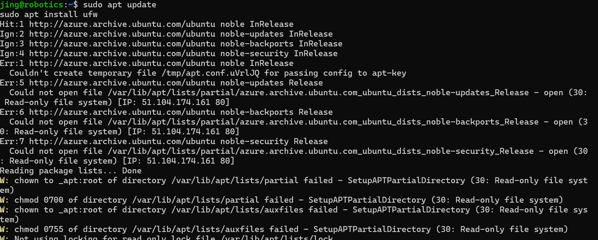
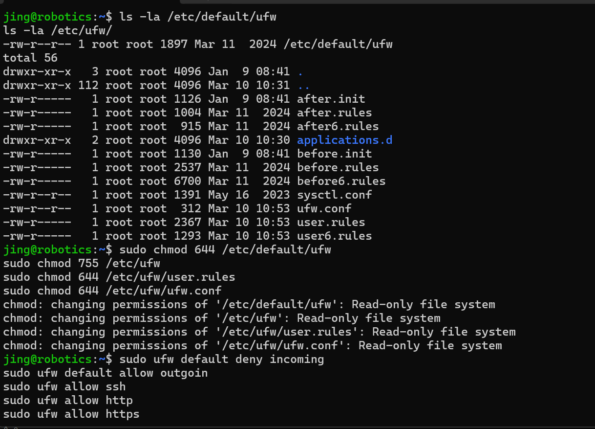
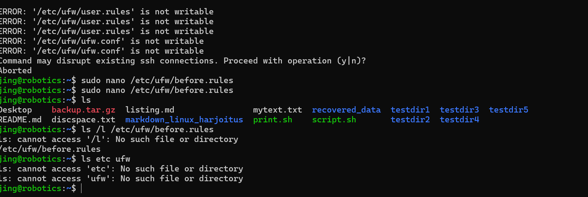
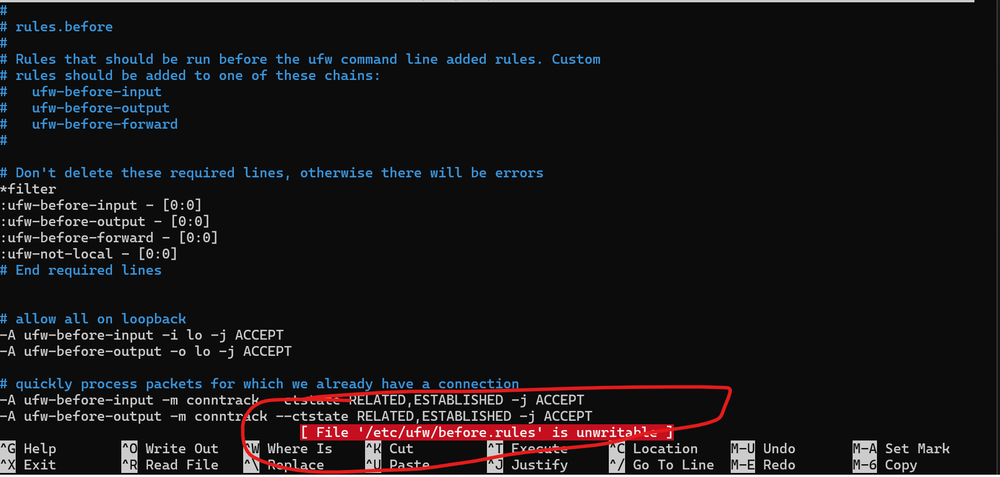

# Firewall Rules Report

## 1. Allowed Services
- **SSH (port 22)**: Allow remote login.
- **HTTP (port 80) & HTTPS (port 443)**: Allow web traffic.

**problem:** something wrong with creation of the rules of firewall. try to figure out it by reinstalling UFW and checking the permission of the files.

## 2. Logging Policy
- Logs all blocked connections.
## 3. SYN Flood Protection
- Limits SYN requests to prevent TCP SYN flood attacks.
**problem:**customer script can not writable

## 4. Additional Security Measures
- Blocks excessive ICMP (ping) requests.
- Default policy: Drop all other incoming traffic.

**problem:**same issues. 

## 5. Conclusion
The file cannot be written due to permission issues. I tried to use the sudo command or restart the system to solve it, but it still didn't work.